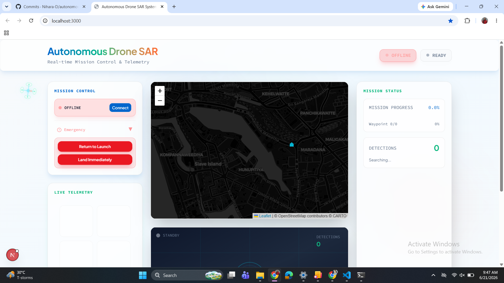

# Autonomous Drone Search & Rescue System

A simulation-based drone autonomy platform for autonomous search and rescue operations. Combines ArduPilot SITL with a full-stack web dashboard for mission planning and real-time telemetry monitoring.



**Author:** Nihara Dayarathne (shniharard@gmail.com)

## Features

- Autonomous grid search with waypoint generation and execution
- Real-time telemetry streaming (10 Hz) to web dashboard
- OpenCV-based colored marker detection
- Interactive mission map with drone tracking and waypoint visualization
- RESTful API with WebSocket support for real-time updates
- Command interface for arm, takeoff, land, and return-to-home operations

## System Architecture

```
Frontend (Next.js)  ←→ WebSocket/REST ←→ Backend (FastAPI)  ←→ MAVLink ←→ ArduPilot SITL
  - Dashboard         - Telemetry API    - DroneKit         
  - Map               - Mission Control  - Vision System    
  - Controls          - Video Stream     - Grid Planner     
```

## Technology Stack

| Component | Technology |
|-----------|-----------|
| **Frontend** | Next.js 16, React, Leaflet, Tailwind CSS |
| **Backend** | Python, FastAPI, DroneKit, OpenCV |
| **Simulation** | ArduPilot SITL, MAVLink Protocol |
| **Real-time** | WebSocket for telemetry streaming |

## Getting Started

### Prerequisites
- Python 3.10+
- Node.js 18+
- pnpm or npm

### Local Setup

**Terminal 1: Start SITL Simulator**
```bash
pip install dronekit-sitl
sim_vehicle.py -v ArduCopter --home=6.9271,79.8612,0,0 --model=quad
```

**Terminal 2: Start Backend**
```bash
cd backend
pip install -r requirements.txt
python main.py
```

**Terminal 3: Start Frontend**
```bash
pnpm install
pnpm dev
```

Open `http://localhost:3000` to access the dashboard.

### Docker Setup
```bash
docker-compose up
```
Then open `http://localhost:3000`

## Basic Usage

1. **Connect**: Click "Connect to Drone" on the dashboard
2. **Arm & Takeoff**: Click "Arm Motors" then "Takeoff to 10m"
3. **Start Mission**: Click "Start Grid Search" to begin autonomous operation
4. **Monitor**: Watch telemetry data, map, and detection results in real-time
5. **Return**: Click "Return to Home" to conclude the mission

The dashboard displays:
- Live drone position and flight path on interactive map
- Real-time telemetry (altitude, speed, heading, battery, GPS)
- Mission progress and detected markers
- Video feed with detection indicators

## API Endpoints

| Endpoint | Method | Purpose |
|----------|--------|---------|
| `/api/drone/connect` | POST | Connect to SITL simulator |
| `/api/drone/arm-takeoff` | POST | Arm motors and takeoff |
| `/api/drone/rtl` | POST | Return to home |
| `/api/drone/land` | POST | Land aircraft |
| `/api/telemetry` | GET | Get current telemetry snapshot |
| `/api/mission/start` | POST | Start autonomous mission |
| `/api/mission/stop` | POST | Stop active mission |
| `/api/detections` | GET | Get all detected markers |
| `/ws/telemetry` | WS | Real-time telemetry stream (10 Hz) |

## Project Structure

```
├── app/                         # Next.js frontend
│   ├── page.tsx                # Dashboard page
│   ├── layout.tsx              # Root layout
│   └── globals.css             # Styles
├── components/                 # React components
│   ├── telemetry-display.tsx  # Status panel
│   ├── mission-control.tsx    # Control buttons
│   ├── mission-map.tsx        # Leaflet map
│   ├── mission-status.tsx     # Progress tracking
│   └── video-feed.tsx         # Camera display
├── backend/                    # Python backend
│   ├── main.py                # FastAPI server
│   ├── config.py              # Configuration
│   └── src/
│       ├── drone_controller.py
│       ├── mission_planner.py
│       └── vision_system.py
├── Dockerfile
└── docker-compose.yml
```

## Configuration

Edit `backend/config.py` to customize:
- Grid search altitude and spacing
- Marker detection color and confidence threshold
- SITL connection parameters
- Telemetry update frequency

## Troubleshooting

| Issue | Solution |
|-------|----------|
| Backend connection fails | Check SITL is running on localhost:14550; verify `backend/config.py` settings |
| WebSocket connection error | Ensure backend is running on port 8000; check browser console |
| Map not displaying | Check browser console for errors; verify Leaflet is loaded |
| No marker detection | Verify OpenCV is installed; check HSV color ranges in `vision_system.py` |
| No telemetry updates | Confirm drone connection is established; check WebSocket in browser dev tools |

## License

MIT License
